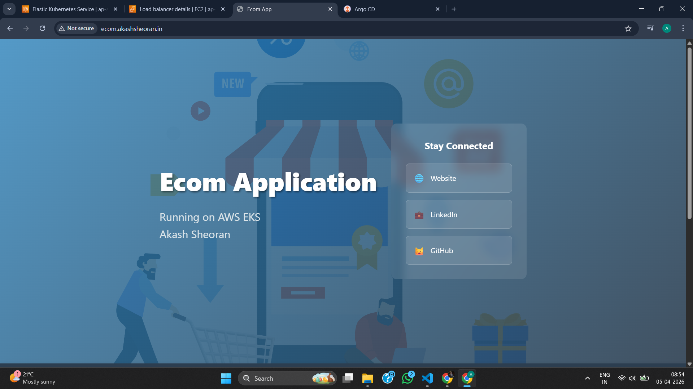
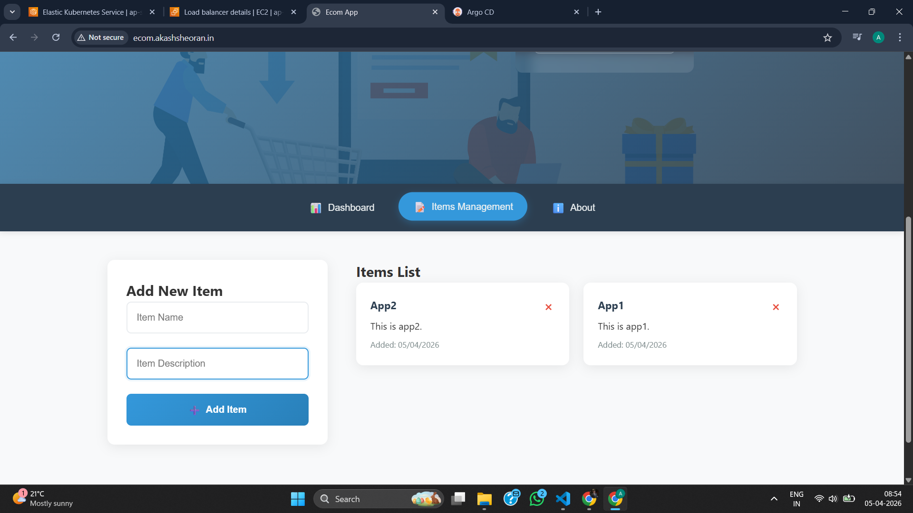
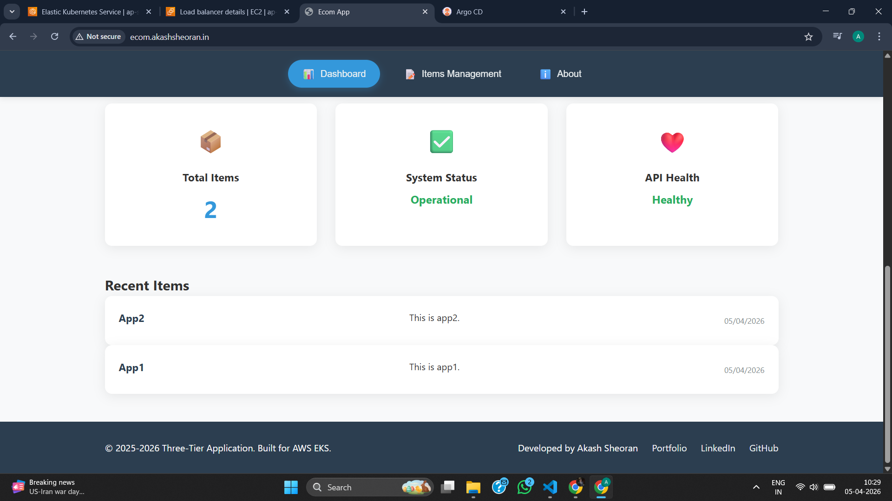
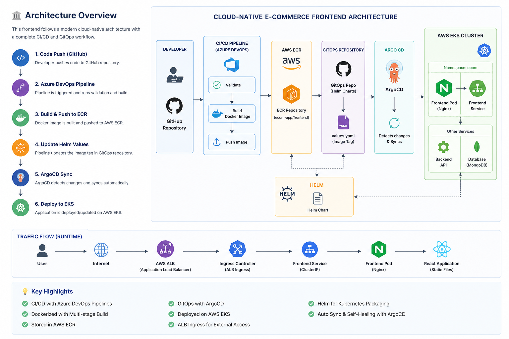

# 🚀 Cloud-Native E-Commerce Frontend

> A production-ready React frontend deployed on **AWS EKS** using **Docker, Kubernetes, and GitOps (ArgoCD)**.

---

## 🧠 About This Project

This repository contains the **frontend service** of a cloud-native e-commerce platform built using modern DevOps and cloud practices.

The application is designed to simulate a **real-world production system**, where code flows through a fully automated CI/CD pipeline and gets deployed to Kubernetes using a GitOps approach.

---

## ✨ Application Preview

### 🏠 Landing Page


---

### 📦 Items Management


---

### 📊 Dashboard


---

## 🧩 Architecture Diagram



---

## 🎯 Key Features

### 🌐 Landing Page
- Clean UI with branding
- Quick access to:
  - Portfolio
  - LinkedIn
  - GitHub

---

### 📦 Items Management
- Add new items dynamically
- Delete items
- Real-time UI updates
- Integrated with backend API

---

### 📊 Dashboard
- Total items count
- System status indicator
- API health status (live backend check)

---

## ⚙️ Tech Stack

| Layer | Technology |
|------|-----------|
| Frontend | React |
| Web Server | Nginx |
| Containerization | Docker |
| CI/CD | Azure DevOps Pipelines |
| Container Registry | AWS ECR |
| Orchestration | Amazon EKS |
| Deployment | ArgoCD (GitOps) |
| Ingress | AWS ALB Ingress Controller |

---

## 🏗️ Architecture Overview

```text
Developer Push (GitHub)
        ↓
Azure DevOps Pipeline
        ↓
Validate → Build Docker Image
        ↓
Push Image to AWS ECR
        ↓
Update Helm Values (GitOps Repo)
        ↓
ArgoCD Sync
        ↓
Deploy to Amazon EKS 🚀